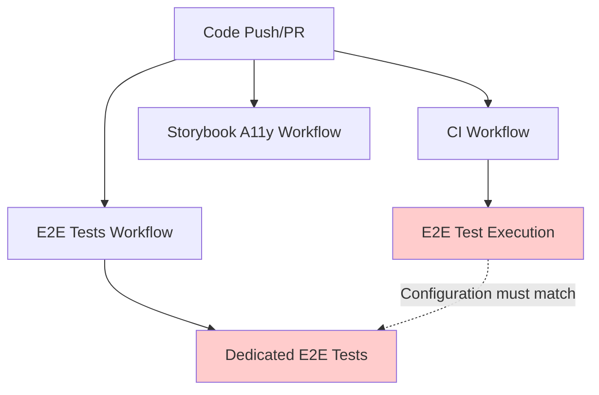

# CI Workflow Alignment Guide

This document provides comprehensive guidance for understanding, maintaining, and troubleshooting CI workflow relationships in the GitPulse project. It explains how our multiple CI workflows interact and the critical importance of keeping configurations synchronized.

## Table of Contents

- [1. Workflow Overview](#1-workflow-overview)
- [2. Workflow Relationships](#2-workflow-relationships)
- [3. Configuration Alignment Requirements](#3-configuration-alignment-requirements)
- [4. Common Alignment Issues](#4-common-alignment-issues)
- [5. Troubleshooting Guide](#5-troubleshooting-guide)
- [6. Maintenance Procedures](#6-maintenance-procedures)

## 1. Workflow Overview

GitPulse uses multiple specialized CI workflows to ensure comprehensive testing and quality assurance:

### 1.1 Primary Workflows

**CI Workflow (`ci.yml`)**
- **Purpose**: Main integration workflow covering builds, tests, security, and E2E testing
- **Triggers**: Push/PR to master/main branches
- **Duration**: 5-15 minutes
- **Key Components**: Build, lint, typecheck, unit tests, security audit, E2E tests, coverage reporting

**End-to-End Tests (`e2e-tests.yml`)**
- **Purpose**: Dedicated E2E testing with optimized configuration
- **Triggers**: Push/PR to master branch
- **Duration**: 10-20 minutes
- **Key Components**: Production build, server startup, Playwright tests

**Storybook Accessibility (`storybook-a11y.yml`)**
- **Purpose**: Accessibility testing for UI components
- **Triggers**: Push/PR to master/main with story file changes
- **Duration**: 1-2 minutes
- **Key Components**: Storybook build, axe-core accessibility tests

### 1.2 Supporting Workflows

**Chromatic Visual Testing (`chromatic.yml`)**
- **Purpose**: Visual regression testing (currently experiencing configuration issues)
- **Status**: Requires configuration fixes for reliable operation

**Debug Storybook (`debug-storybook.yml`)**
- **Purpose**: Manual debugging workflow for Storybook issues
- **Trigger**: Manual dispatch only

## 2. Workflow Relationships

### 2.1 Critical Dependencies



**The most critical relationship** is between E2E test execution in the main CI workflow and the dedicated E2E tests workflow. These must have identical configurations to ensure consistent behavior.

### 2.2 Configuration Synchronization Points

| Configuration Element | CI Workflow | E2E Workflow | Critical |
|----------------------|-------------|--------------|----------|
| Node.js version | ✅ Node 22 | ✅ Node 22 | 🔴 HIGH |
| Playwright config | ✅ --retries=2 | ✅ --retries=2 | 🔴 HIGH |
| Reporter settings | ✅ list,html | ✅ list,html | 🔴 HIGH |
| Timeout values | ✅ 120000ms | ✅ 120000ms | 🔴 HIGH |
| Environment variables | ✅ Aligned | ✅ Aligned | 🔴 HIGH |
| Server startup method | ✅ npm run dev | ✅ npm run start | 🟡 MEDIUM |

## 3. Configuration Alignment Requirements

### 3.1 E2E Configuration Alignment

**Why Critical**: The main CI workflow includes E2E tests alongside other checks, while the dedicated E2E workflow focuses solely on E2E testing. Configuration mismatches lead to different test behavior and unreliable results.

**Required Synchronized Elements:**

```yaml
# Both workflows must have identical:
- name: Run E2E Tests
  run: npx playwright test --project=chromium --retries=2 --reporter=list,html
  timeout-minutes: 120
  env:
    DEBUG: pw:api,pw:browser*
    PWDEBUG: console
    NODE_ENV: test
    CI: true
```

### 3.2 Environment Variable Alignment

**Critical Variables** that must be consistent across workflows:

```bash
# Playwright Configuration
DEBUG: pw:api,pw:browser*
PWDEBUG: console

# Application Configuration  
NODE_ENV: test
NEXTAUTH_URL: http://localhost:3000
NEXT_PUBLIC_GITHUB_APP_NAME: pulse-summarizer

# CI Environment
CI: true
```

### 3.3 Server Startup Alignment

**Important Note**: While both workflows start development servers, they use different commands:
- **CI Workflow**: `npm run dev` (development server for integration testing)
- **E2E Workflow**: `npm run start` (production server for dedicated testing)

This difference is intentional but requires careful port management and cleanup procedures.

## 4. Common Alignment Issues

### 4.1 Configuration Drift

**Symptoms:**
- Tests pass in one workflow but fail in another
- Intermittent failures without code changes
- Different execution times between workflows

**Root Causes:**
- Manual updates to one workflow without updating others
- Copy-paste errors during configuration changes
- Missing environment variables

**Prevention:**
- Always update configurations in pairs
- Use checklist verification (see Section 6.2)
- Review both workflows in pull request reviews

### 4.2 Port Conflicts

**Symptoms:**
- Server startup failures with "port already in use" errors
- E2E tests failing to connect to application server
- Process cleanup issues

**Solutions:**
```bash
# Port cleanup before server startup
- name: Clean up ports
  run: |
    lsof -ti:3000 | xargs kill -9 2>/dev/null || true
    sleep 2
```

### 4.3 Timing Issues

**Symptoms:**
- Authentication persistence tests failing in CI only
- Server readiness check timeouts
- Race conditions in test execution

**Solutions:**
- Add conditional CI delays: `if (process.env.CI) { await page.waitForTimeout(500); }`
- Implement health checks: `node scripts/wait-for-server.js`
- Use retry logic: `--retries=2`

## 5. Troubleshooting Guide

### 5.1 Step-by-Step Diagnosis

**Step 1: Identify Divergent Behavior**
```bash
# Compare recent workflow runs
gh run list --limit 10 --json status,conclusion,name,number

# Look for patterns:
# - Same commit, different outcomes between workflows
# - Timing differences in similar operations
# - Environment-specific failures
```

**Step 2: Configuration Comparison**
```bash
# Use diff to compare workflow configurations
diff .github/workflows/ci.yml .github/workflows/e2e-tests.yml

# Focus on sections:
# - Environment variables
# - Command parameters
# - Timeout values
# - Node.js versions
```

**Step 3: Environment Analysis**
```bash
# Check for environment variable mismatches
grep -r "env:" .github/workflows/
grep -r "NODE_ENV\|DEBUG\|PWDEBUG" .github/workflows/
```

### 5.2 Debugging Commands

**Local Simulation of CI Environment:**
```bash
# Simulate CI E2E execution locally
CI=true DEBUG=pw:api,pw:browser* npm run test:e2e -- --project=chromium --retries=2

# Test server startup sequence
npm run dev & 
sleep 5
node scripts/wait-for-server.js
npm run test:e2e
```

**Workflow Status Monitoring:**
```bash
# Monitor live workflow execution
gh run watch <run-id>

# Get detailed workflow logs
gh run view <run-id> --log

# Compare workflow performance
gh run list --json status,conclusion,name,startedAt,updatedAt
```

### 5.3 Common Fix Patterns

**Configuration Alignment Fix:**
1. Identify the "source of truth" workflow (usually the one working correctly)
2. Copy critical configuration sections to misaligned workflow
3. Verify environment variables match exactly
4. Test with minimal commits to validate fixes

**Port Conflict Resolution:**
```bash
# Add to both workflows before server startup
- name: Clean up ports and processes
  run: |
    # Kill any processes on port 3000
    lsof -ti:3000 | xargs kill -9 2>/dev/null || true
    # Wait for port to be freed
    sleep 2
    # Verify port is available
    ! lsof -ti:3000 || (echo "Port 3000 still in use" && exit 1)
```

## 6. Maintenance Procedures

### 6.1 Regular Alignment Verification

**Monthly Checklist:**
- [ ] Compare E2E configurations between CI and E2E workflows
- [ ] Verify Node.js versions match across all workflows
- [ ] Check environment variable consistency
- [ ] Review workflow success rates and execution times
- [ ] Update this documentation if new alignment requirements emerge

### 6.2 Change Management Process

**When modifying CI workflows:**

1. **Identify Impact Scope**
   - List all workflows that might be affected
   - Determine which configurations need synchronization

2. **Update in Pairs**
   - Never update just one workflow in isolation
   - Use side-by-side editing to ensure consistency

3. **Verification Steps**
   ```bash
   # Before committing changes
   diff .github/workflows/ci.yml .github/workflows/e2e-tests.yml
   
   # Focus on E2E test sections specifically
   grep -A 20 -B 5 "Run E2E Tests" .github/workflows/ci.yml
   grep -A 20 -B 5 "Run tests" .github/workflows/e2e-tests.yml
   ```

4. **Test Validation**
   - Commit changes and monitor both workflows
   - Verify success rates remain consistent
   - Check for new timing or configuration issues

### 6.3 Emergency Procedures

**If CI workflows become misaligned and cause failures:**

1. **Immediate Stabilization**
   - Identify the working workflow configuration
   - Temporarily disable failing workflow if necessary
   - Apply urgent fixes to restore functionality

2. **Root Cause Analysis**
   - Document what changed and when
   - Identify the configuration drift that caused the issue
   - Update this guide with new prevention measures

3. **Systematic Resolution**
   - Apply fixes to all affected workflows simultaneously
   - Validate with test commits across multiple runs
   - Update documentation and team knowledge

## 7. Related Documentation

- [Storybook CI Testing Guide](./STORYBOOK_CI.md) - CI-specific Storybook testing
- [E2E Mock Auth Strategy](../testing/E2E_MOCK_AUTH_STRATEGY.md) - Authentication testing patterns
- [CI Overview](../../ci/README.md) - General CI process documentation
- [Development Philosophy](../architecture/DEVELOPMENT_PHILOSOPHY.md) - Quality standards and CI requirements

## 8. Version History

- **v1.0** (June 2025): Initial comprehensive CI workflow alignment guide
- Created after resolving critical CI alignment issues in the atomic design integration
- Based on extensive CI failure analysis and resolution documentation